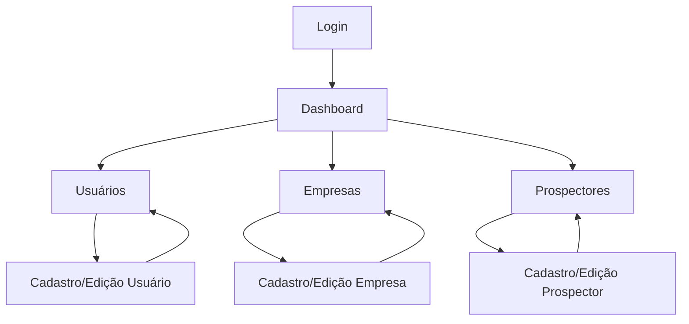

# Sistema de Design Nexxus - Especificações Completas

## 1. Visão Geral do Produto

O Nexxus é uma plataforma de gestão empresarial moderna que oferece funcionalidades de administração de usuários, empresas e prospectores. O redesign visa criar uma experiência visual consistente, profissional e intuitiva, baseada na identidade visual apresentada nas imagens de referência.

## 2. Funcionalidades Principais

### 2.1 Módulos do Sistema

**Dashboard Principal**
- Visão geral de métricas e indicadores
- Navegação rápida para módulos principais
- Cards informativos com dados resumidos

**Gestão de Usuários**
- Listagem, criação, edição e exclusão de usuários
- Validação de dados pessoais (CPF, data de nascimento)
- Controle de status e permissões

**Gestão de Empresas (Tenants)**
- Cadastro completo de empresas
- Validação de CNPJ e dados corporativos
- Gerenciamento de endereços e contatos

**Gestão de Prospectores**
- Cadastro e acompanhamento de prospectores
- Controle de atividades e performance
- Relatórios de prospecção

### 2.2 Detalhes das Páginas

| Página | Módulo | Descrição da Funcionalidade |
|--------|--------|------------------------------|
| Dashboard | Painel Principal | Exibir métricas gerais, navegação rápida, cards de resumo com dados atualizados |
| Login | Autenticação | Formulário de login com validação, recuperação de senha, interface responsiva |
| Usuários | Gestão de Pessoas | Tabela de usuários, formulários de cadastro/edição, validação de CPF e data nascimento, controle de status |
| Empresas | Gestão Corporativa | Listagem de empresas, formulários completos, validação CNPJ, gestão de endereços |
| Prospectores | Gestão Comercial | Cadastro de prospectores, acompanhamento de atividades, relatórios de performance |

## 3. Fluxo Principal de Navegação



## 4. Sistema de Design Visual

### 4.1 Paleta de Cores

**Cores Primárias**
- **Navy Blue**: `#1e3a5f` - Cor principal da marca, usada em headers, botões primários e elementos de destaque
- **Navy Blue Hover**: `#2d4a6f` - Variação para estados de hover e interação

**Cores Secundárias**
- **White**: `#ffffff` - Backgrounds principais, texto em elementos escuros
- **Light Gray**: `#f8f9fa` - Backgrounds secundários, áreas de conteúdo

**Cores Neutras**
```css
--neutral-50: #f8f9fa;   /* Backgrounds muito claros */
--neutral-100: #f1f3f4;  /* Borders suaves */
--neutral-200: #e9ecef;  /* Separadores */
--neutral-300: #dee2e6;  /* Borders padrão */
--neutral-400: #ced4da;  /* Placeholders */
--neutral-500: #adb5bd;  /* Texto secundário */
--neutral-600: #6c757d;  /* Texto terciário */
--neutral-700: #495057;  /* Texto principal */
--neutral-800: #343a40;  /* Texto escuro */
--neutral-900: #111827;  /* Texto muito escuro */
```

**Cores Semânticas**
```css
--success: #10b981;      /* Ações positivas, confirmações */
--warning: #f59e0b;      /* Alertas, atenção */
--error: #ef4444;        /* Erros, ações destrutivas */
--info: #3b82f6;         /* Informações, dicas */
```

### 4.2 Tipografia

**Família de Fontes**
- **Principal**: Inter (Google Fonts)
- **Fallback**: -apple-system, BlinkMacSystemFont, 'Segoe UI', Roboto, sans-serif

**Escala Tipográfica**
```css
--text-xs: 0.75rem;      /* 12px - Labels pequenos */
--text-sm: 0.875rem;     /* 14px - Texto secundário */
--text-base: 1rem;       /* 16px - Texto padrão */
--text-lg: 1.125rem;     /* 18px - Texto destacado */
--text-xl: 1.25rem;      /* 20px - Subtítulos */
--text-2xl: 1.5rem;      /* 24px - Títulos de seção */
--text-3xl: 1.875rem;    /* 30px - Títulos principais */
--text-4xl: 2.25rem;     /* 36px - Títulos de página */
```

**Pesos de Fonte**
```css
--font-light: 300;       /* Texto muito leve */
--font-normal: 400;      /* Texto padrão */
--font-medium: 500;      /* Texto destacado */
--font-semibold: 600;    /* Subtítulos */
--font-bold: 700;        /* Títulos */
```

### 4.3 Espaçamento e Layout

**Sistema de Espaçamento (baseado em 4px)**
```css
--space-1: 0.25rem;      /* 4px */
--space-2: 0.5rem;       /* 8px */
--space-3: 0.75rem;      /* 12px */
--space-4: 1rem;         /* 16px */
--space-5: 1.25rem;      /* 20px */
--space-6: 1.5rem;       /* 24px */
--space-8: 2rem;         /* 32px */
--space-10: 2.5rem;      /* 40px */
--space-12: 3rem;        /* 48px */
--space-16: 4rem;        /* 64px */
--space-20: 5rem;        /* 80px */
```

**Breakpoints Responsivos**
```css
--breakpoint-sm: 640px;   /* Mobile grande */
--breakpoint-md: 768px;   /* Tablet */
--breakpoint-lg: 1024px;  /* Desktop pequeno */
--breakpoint-xl: 1280px;  /* Desktop grande */
--breakpoint-2xl: 1536px; /* Desktop muito grande */
```

### 4.4 Sombras e Elevação

```css
--shadow-xs: 0 1px 2px 0 rgb(0 0 0 / 0.05);
--shadow-sm: 0 1px 3px 0 rgb(0 0 0 / 0.1), 0 1px 2px -1px rgb(0 0 0 / 0.1);
--shadow-md: 0 4px 6px -1px rgb(0 0 0 / 0.1), 0 2px 4px -2px rgb(0 0 0 / 0.1);
--shadow-lg: 0 10px 15px -3px rgb(0 0 0 / 0.1), 0 4px 6px -4px rgb(0 0 0 / 0.1);
--shadow-xl: 0 20px 25px -5px rgb(0 0 0 / 0.1), 0 8px 10px -6px rgb(0 0 0 / 0.1);
```

### 4.5 Bordas e Raios

```css
--radius-none: 0;
--radius-sm: 0.125rem;    /* 2px */
--radius-md: 0.375rem;    /* 6px */
--radius-lg: 0.5rem;      /* 8px */
--radius-xl: 0.75rem;     /* 12px */
--radius-2xl: 1rem;       /* 16px */
--radius-full: 9999px;    /* Circular */
```

## 5. Componentes de Interface

### 5.1 Botões

| Variante | Estilo | Uso |
|----------|--------|-----|
| Primary | Background navy, texto branco | Ações principais, CTAs |
| Secondary | Background branco, borda navy, texto navy | Ações secundárias |
| Outline | Apenas borda, background transparente | Ações terciárias |
| Ghost | Apenas texto, sem background/borda | Links, ações sutis |

**Estados dos Botões**
- **Default**: Estado padrão
- **Hover**: Mudança sutil de cor/opacidade
- **Active**: Estado pressionado
- **Disabled**: Opacidade reduzida, não interativo
- **Loading**: Spinner ou indicador de carregamento

### 5.2 Formulários

**Campos de Input**
- Border radius: `--radius-md`
- Padding: `--space-3` vertical, `--space-4` horizontal
- Border: 1px solid `--neutral-300`
- Focus: Border `--color-primary`, shadow azul sutil

**Labels**
- Font weight: `--font-medium`
- Margin bottom: `--space-2`
- Color: `--neutral-700`

**Mensagens de Erro**
- Color: `--error`
- Font size: `--text-sm`
- Margin top: `--space-1`

### 5.3 Cards e Containers

**Card Padrão**
- Background: `--color-secondary` (branco)
- Border radius: `--radius-lg`
- Shadow: `--shadow-sm`
- Padding: `--space-6`

**Card com Header**
- Header com background `--neutral-50`
- Separador com border `--neutral-200`
- Conteúdo com padding diferenciado

### 5.4 Navegação

**Sidebar**
- Width: 280px (desktop), full width (mobile)
- Background: `--color-primary` (navy)
- Texto: branco
- Items com hover sutil

**Header/Topbar**
- Height: 64px
- Background: branco
- Shadow: `--shadow-sm`
- Elementos alinhados à direita

## 6. Responsividade Mobile-First

### 6.1 Estratégia de Layout

**Mobile (< 768px)**
- Sidebar colapsada/drawer
- Stack vertical de elementos
- Padding reduzido
- Botões full-width quando apropriado

**Tablet (768px - 1024px)**
- Sidebar fixa ou colapsável
- Grid de 2 colunas para cards
- Espaçamento intermediário

**Desktop (> 1024px)**
- Layout completo com sidebar fixa
- Grid de 3-4 colunas
- Espaçamento completo
- Hover states ativos

### 6.2 Componentes Responsivos

| Componente | Mobile | Tablet | Desktop |
|------------|--------|--------|---------|
| Sidebar | Drawer overlay | Colapsável | Fixa expandida |
| Cards | 1 coluna | 2 colunas | 3-4 colunas |
| Tabelas | Scroll horizontal | Responsiva | Completa |
| Formulários | 1 coluna | 2 colunas | 2-3 colunas |
| Botões | Full width | Auto width | Auto width |

## 7. Padrões de Interação

### 7.1 Estados de Loading
- Skeleton screens para carregamento inicial
- Spinners para ações pontuais
- Progress bars para uploads/downloads
- Disabled states durante processamento

### 7.2 Feedback Visual
- Toast notifications para ações
- Modal confirmations para ações destrutivas
- Inline validation em formulários
- Hover effects sutis em elementos interativos

### 7.3 Animações e Transições
- Duração padrão: 200ms
- Easing: ease-in-out
- Fade in/out para modals
- Slide para drawers/sidebars
- Micro-interactions em botões e links

## 8. Acessibilidade

### 8.1 Contraste de Cores
- Ratio mínimo 4.5:1 para texto normal
- Ratio mínimo 3:1 para texto grande
- Cores semânticas com significado além da cor

### 8.2 Navegação por Teclado
- Tab order lógico
- Focus indicators visíveis
- Skip links quando necessário
- Atalhos de teclado para ações principais

### 8.3 Semântica HTML
- Headings hierárquicos (h1, h2, h3...)
- Labels associados a inputs
- ARIA attributes quando necessário
- Landmarks para navegação

## 9. Performance e Otimização

### 9.1 Carregamento
- Lazy loading de imagens
- Code splitting por rotas
- Preload de recursos críticos
- Compressão de assets

### 9.2 Renderização
- Memoização de componentes pesados
- Virtualização de listas longas
- Debounce em inputs de busca
- Throttle em scroll events

### 9.3 Bundle Size
- Tree shaking de dependências
- Análise de bundle size
- Remoção de código morto
- Otimização de imports

Este sistema de design serve como base para a implementação consistente e escalável da interface Nexxus, garantindo uma experiência de usuário moderna, profissional e acessível.