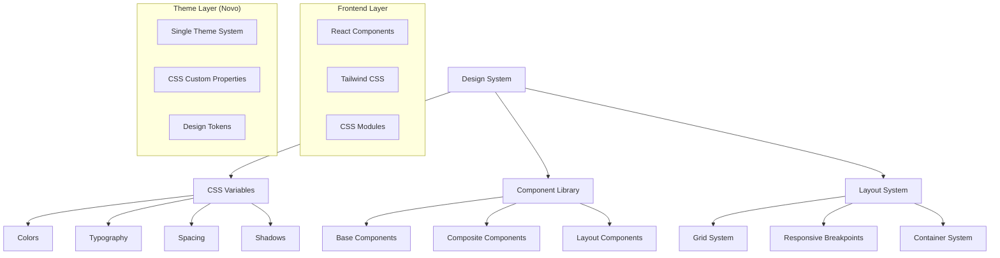
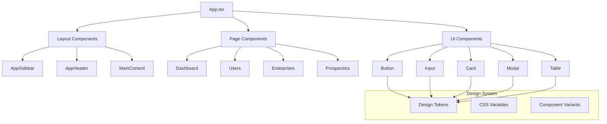
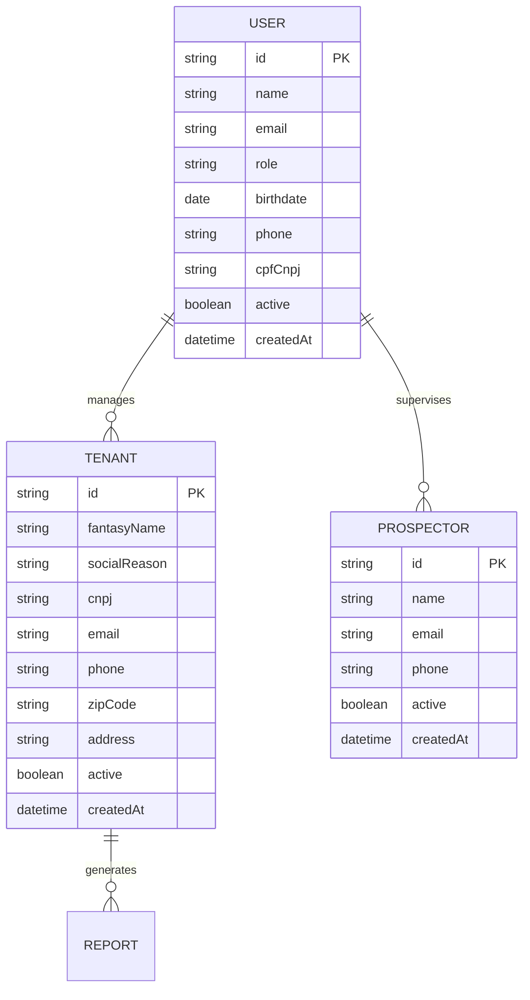

# Arquitetura Técnica - Redesign Nexxus

## 1. Arquitetura de Design



## 2. Tecnologias e Dependências

### 2.1 Frontend Stack
- **React**: 18.x (mantido)
- **TypeScript**: 5.x (mantido)
- **Vite**: 7.x (mantido)
- **Tailwind CSS**: 3.x (atualizado para novo sistema)

### 2.2 Removidas
- **ThemeContext**: Sistema de tema dark/light removido
- **useTheme hook**: Hook de alternância de tema removido
- **Variáveis de tema duplo**: CSS variables para dark/light removidas

### 2.3 Adicionadas
- **Design System**: Sistema unificado de design tokens
- **CSS Custom Properties**: Variáveis CSS para tema único
- **Component Variants**: Sistema de variantes para componentes

## 3. Estrutura de Rotas

### 3.1 Rotas Principais
| Rota | Propósito | Status |
|------|-----------|--------|
| `/` | Dashboard principal | Mantida |
| `/login` | Autenticação de usuários | Mantida |
| `/users` | Gerenciamento de usuários | Atualizada |
| `/enterprises` | Gerenciamento de empresas | Atualizada |
| `/prospectors` | Gerenciamento de prospectores | Mantida |
| `/reports` | Relatórios (oculta na sidebar) | Mantida |

### 3.2 Rotas Removidas
| Rota | Motivo da Remoção |
|------|-------------------|
| `/plans` | Funcionalidade não utilizada |
| `/partners` | Funcionalidade não utilizada |

## 4. Definições de API

### 4.1 Endpoints Mantidos

**Autenticação**
```typescript
POST /api/auth/login
POST /api/auth/logout
POST /api/auth/refresh
```

**Usuários**
```typescript
GET /api/users
POST /api/users
PUT /api/users/:id
DELETE /api/users/:id
```

**Empresas (Tenants)**
```typescript
GET /api/tenants
POST /api/tenants
PUT /api/tenants/:id
DELETE /api/tenants/:id
```

**Prospectores**
```typescript
GET /api/users/prospectors
POST /api/users/prospectors
PUT /api/users/prospectors/:id
DELETE /api/users/prospectors/:id
```

### 4.2 Tipos TypeScript Atualizados

```typescript
// Theme System (Novo)
interface DesignTokens {
  colors: {
    primary: string;
    secondary: string;
    neutral: Record<string, string>;
    semantic: {
      success: string;
      warning: string;
      error: string;
      info: string;
    };
  };
  typography: {
    fontFamily: Record<string, string>;
    fontSize: Record<string, string>;
    fontWeight: Record<string, number>;
    lineHeight: Record<string, number>;
  };
  spacing: Record<string, string>;
  shadows: Record<string, string>;
  borderRadius: Record<string, string>;
}

// Component Props (Atualizado)
interface ComponentProps {
  variant?: 'primary' | 'secondary' | 'outline' | 'ghost';
  size?: 'sm' | 'md' | 'lg';
  disabled?: boolean;
  loading?: boolean;
}
```

## 5. Arquitetura de Componentes



## 6. Sistema de Temas (Novo)

### 6.1 Estrutura de Arquivos
```
src/
├── styles/
│   ├── globals.css          # Estilos globais e reset
│   ├── variables.css        # CSS custom properties
│   ├── components.css       # Estilos de componentes base
│   └── utilities.css        # Classes utilitárias
├── components/
│   ├── ui/                  # Componentes base
│   │   ├── button.tsx
│   │   ├── input.tsx
│   │   ├── card.tsx
│   │   └── ...
│   └── layout/              # Componentes de layout
│       ├── sidebar.tsx
│       ├── header.tsx
│       └── ...
└── lib/
    ├── design-tokens.ts     # Tokens de design
    └── utils.ts            # Utilitários
```

### 6.2 CSS Custom Properties
```css
/* variables.css */
:root {
  /* Cores Primárias */
  --color-primary: #1e3a5f;
  --color-primary-hover: #2d4a6f;
  --color-secondary: #ffffff;
  
  /* Cores Neutras */
  --color-neutral-50: #f8f9fa;
  --color-neutral-100: #f1f3f4;
  --color-neutral-900: #111827;
  
  /* Tipografia */
  --font-family-sans: 'Inter', sans-serif;
  --font-size-base: 1rem;
  --font-weight-medium: 500;
  
  /* Espaçamento */
  --space-1: 0.25rem;
  --space-4: 1rem;
  --space-6: 1.5rem;
  
  /* Sombras */
  --shadow-sm: 0 1px 2px 0 rgb(0 0 0 / 0.05);
  --shadow-md: 0 4px 6px -1px rgb(0 0 0 / 0.1);
}
```

## 7. Modelo de Dados

### 7.1 Entidades Principais



### 7.2 DDL para Novas Estruturas

```sql
-- Atualização da tabela de usuários
ALTER TABLE users ADD COLUMN IF NOT EXISTS birthdate DATE;
ALTER TABLE users ADD COLUMN IF NOT EXISTS cpf_cnpj VARCHAR(20);

-- Índices para performance
CREATE INDEX IF NOT EXISTS idx_users_active ON users(active);
CREATE INDEX IF NOT EXISTS idx_users_role ON users(role);
CREATE INDEX IF NOT EXISTS idx_tenants_active ON tenants(active);
```

## 8. Performance e Otimizações

### 8.1 Estratégias de Performance
- **CSS-in-JS removido**: Uso de CSS puro para melhor performance
- **Tree shaking**: Remoção de código não utilizado
- **Code splitting**: Carregamento lazy de componentes
- **Memoização**: React.memo para componentes pesados

### 8.2 Otimizações de Bundle
```typescript
// vite.config.ts
export default defineConfig({
  build: {
    rollupOptions: {
      output: {
        manualChunks: {
          vendor: ['react', 'react-dom'],
          ui: ['@radix-ui/react-dialog', '@radix-ui/react-dropdown-menu'],
        },
      },
    },
  },
  css: {
    modules: {
      localsConvention: 'camelCase',
    },
  },
});
```

## 9. Responsividade Mobile-First

### 9.1 Breakpoints
```css
/* Mobile First Approach */
.container {
  padding: 1rem;
}

@media (min-width: 640px) {
  .container { padding: 1.5rem; }
}

@media (min-width: 768px) {
  .container { padding: 2rem; }
}

@media (min-width: 1024px) {
  .container { 
    padding: 2rem;
    max-width: 1280px;
    margin: 0 auto;
  }
}
```

### 9.2 Componentes Responsivos
```typescript
// Exemplo de componente responsivo
interface ResponsiveProps {
  mobile?: boolean;
  tablet?: boolean;
  desktop?: boolean;
}

const ResponsiveComponent: React.FC<ResponsiveProps> = ({
  mobile = true,
  tablet = true,
  desktop = true,
}) => {
  const isMobile = useMediaQuery('(max-width: 768px)');
  
  return (
    <div className={cn(
      'component-base',
      mobile && 'mobile:block',
      tablet && 'tablet:block',
      desktop && 'desktop:block'
    )}>
      {/* Conteúdo */}
    </div>
  );
};
```

## 10. Migração e Implementação

### 10.1 Fases de Implementação

**Fase 1: Preparação (1-2 dias)**
- Remoção do sistema de temas dark/light
- Implementação das novas CSS variables
- Configuração do novo sistema de design

**Fase 2: Componentes Base (2-3 dias)**
- Atualização de Button, Input, Card
- Implementação de novos variants
- Testes de componentes

**Fase 3: Layout e Navegação (1-2 dias)**
- Atualização do Sidebar e Header
- Implementação do novo layout responsivo
- Ajustes de navegação mobile

**Fase 4: Páginas Principais (2-3 dias)**
- Migração das páginas Users, Enterprises
- Atualização do Dashboard
- Refinamentos visuais

**Fase 5: Testes e Otimização (1 dia)**
- Testes de responsividade
- Otimizações de performance
- Validação final

### 10.2 Checklist de Migração

- [ ] Remover ThemeContext e useTheme
- [ ] Implementar novas CSS variables
- [ ] Atualizar componentes base
- [ ] Migrar layout principal
- [ ] Atualizar páginas
- [ ] Testes responsivos
- [ ] Otimizações de performance
- [ ] Documentação atualizada

## 11. Manutenção e Evolução

### 11.1 Versionamento do Design System
- Uso de semantic versioning para mudanças
- Changelog detalhado para cada versão
- Backward compatibility quando possível

### 11.2 Monitoramento
- Performance metrics
- User experience analytics
- Error tracking e logging

Este documento serve como guia técnico completo para a implementação do novo sistema de design Nexxus, garantindo consistência, performance e manutenibilidade.